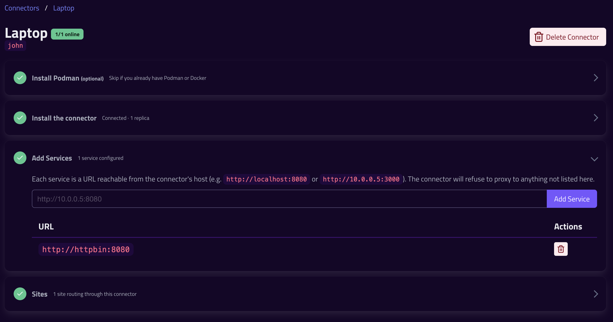

# This Week At Ingressive - Week 1

This is the first weekly progress report for Ingressive. 

The focus for this week was on building out the global, self healing mesh network. We did this from two ends: upgrading our global edge network, and building out our control plane to connect user origins into it. 

## Edge Network 
Probably the most exciting news, we now have an initial edge network online. This means Ingressive is now ready to bring dev / testing projects over. 

## Connector Networking

This involved: 
- Upgrading our edge network
- Pulling out a previous attempt at the global networking
- Writing a provisioning management layer
- Upgrading the previously barebones connector code

I'm quite proud of this connector UI. It's built entirely around the flow of getting the connector set up 

This page guides you naturally through installing a connector, adding services that it's allowed to access, then connecting it up to an edge site. Once set up, the "install connector" area becomes the "here's your running connectors" area. 

## IAM

A brief update to the IAM system to accommodate the rest of the work this week.

We added a Service Users system to give things like Connectors and Ingress Controllers credentials. There is no UI for this just yet, but it will be coming soon. 

## Next Steps 
We are a Kubernetes shop. In order to dogfood Ingressive, we pretty much need a Kubernetes Ingress controller. This will be our focus next week. 