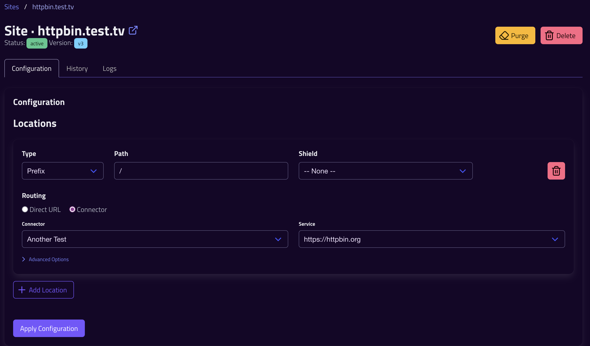
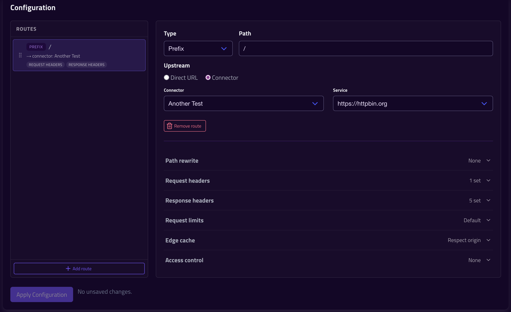

# This Week at Ingressive: Week 2

This week at Ingressive was mostly focused on the Ingress Controller, but we had to take a couple of detours to get there. 

## Ingressive Controller!
Amaze amaze amaze. The Controller alpha is finally here. As a Kubernetes shop, this means we can start to test Ingressive internally with much tighter feedback loops. 

## New Site Configuration
We built a new Site configuration UI, and greatly expanded the options available in our configuration file format. 

The old editor wasn't laid out that well, and relied on hiding details behind an "Advanced" accordion. But, it worked for a v0. 

The new editor uses a two-pane layout, with accordion sections for the various types of options. We also expanded the options available to include:
- Limits: On upload size, and customisable request timeouts
- Path rewrites: Easily strip `/api` if your API isn't expecting it.
- Edge cache: Still defaults to respecting the origin. You can now set an explicit edge expiry to override this if desired (combine with our "extensions" location type maybe?)

## Bug Fixes
A handful of bugfixes this week. More are expected as we start dogfooding.

- Fixed bug with CSRF timeouts
- Fixed ACME renewals not being pushed to edge nodes correctly